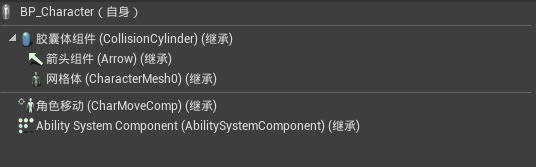

# ActionRPG文档

[TOC]

## 1.  关于ActionRPG

### 1.1  ActionRPG简介

### 1.2  ActionRPG的安装方法

### 1.3 ActionRPG的学习途径

### 1.4 关于本文档

本文档地址：https://github.com/Nicholala/ActionPRGDocumentation

## 2. UE4 GamePlay架构

在学习ActionRPG之前，我们需要了解UE4 的GamePlay架构，这样会有助于我们理解ActionPRG中的各个蓝图具体实现的是什么功能，以及为什么要用这种蓝图实现这个功能。

### 2.1 UObject

### 2.2 Actor

### 2.3 Component

## 3.  GAS系统

### 3.1什么是GAS

Gameplay Ability System(GAS)是一个高度灵活的框架，可用于构建你可能会在RPG或MOBA游戏中看到的技能和属性类型。你可以构建可供游戏中的角色使用的动作或被动技能，使这些动作导致各种属性累积或损耗的状态效果，实现约束这些动作使用的“冷却”计时器或资源消耗，更改技能等级及每个技能等级的技能效果，激活粒子或音效，等等。此系统可帮助你在任何现代RPG或MOBA游戏中设计、实现及高效关联各种游戏中的技能，既包括跳跃等简单技能，也包括你喜欢的角色的复杂技能集。

以上是官方文档对GAS的介绍，简单来说GAS是Epic官方提供的一款UE4插件，是用于让程序员和策划设计玩法的端到端系统。

## 4.  ActionRpg功能实现介绍

本章介绍了ActionRPG项目中各项功能的实现方法，当然，ActionRPG是一个庞大复杂且在不断更新的项目，同时本人对UE4的理解水平还有待提升，因此本章介绍的功能实现可能与ActionRPG真正实现方法有一定出入，

### 4.1 角色与摄像机的基本移动

### 4.1.1  ARPGCharacterBase

要让角色动起来，首先得有个角色。而ActionRPG中游戏的基类，就是ARPGCharacterBase。ARPGCharacterBase是一个C++类，我们可以看一部分ARPGCharacterBase.h文件中的代码来大致了解这个类的作用。

```c++
/** Base class for Character, Designed to be blueprinted */
UCLASS()
class ACTIONRPG_API ARPGCharacterBase : public ACharacter, public IAbilitySystemInterface, public IGenericTeamAgentInterface
{
	GENERATED_BODY()
public:
	// Constructor and overrides
	ARPGCharacterBase();
    
	/** Returns current health, will be 0 if dead */
	UFUNCTION(BlueprintCallable)
	virtual float GetHealth() const;
    
	/** Returns maximum health, health will never be greater than this */
	UFUNCTION(BlueprintCallable)
	virtual float GetMaxHealth() const;
    
	/** Returns current mana */
	UFUNCTION(BlueprintCallable)
	virtual float GetMana() const;
    
	/** Returns maximum mana, mana will never be greater than this */
	UFUNCTION(BlueprintCallable)
	virtual float GetMaxMana() const;
    
	/** Returns current movement speed */
	UFUNCTION(BlueprintCallable)
	virtual float GetMoveSpeed() const;
    
	/** Returns the character level that is passed to the ability system */
	UFUNCTION(BlueprintCallable)
	virtual int32 GetCharacterLevel() const;
    
	/** Modifies the character level, this may change abilities. Returns true on success */
	UFUNCTION(BlueprintCallable)
	virtual bool SetCharacterLevel(int32 NewLevel);
}
```

我们可以看到这个类中，包含了一些具有普遍性的方法。例如获取血量 GetHealth()，或者获取移动速度GetMoveSpeed()等。ARPGCharacterBase中还包含了许多方法，不过目前我们只需要知道ActionPRG项目中的角色的基类是ARPGCharacterBase就行了。

### 4.1.2 BP_Character

BP_Character是一个蓝图类，这个类继承了ARPGCharacterBase。我们来看看这个类中有哪些Component。




### 4.1.3 BP_PlayerCharacter

### 4.1.4 BP_PlayerController

### 4.2 武器相关功能

### 4.3 攻击

## 参考资料